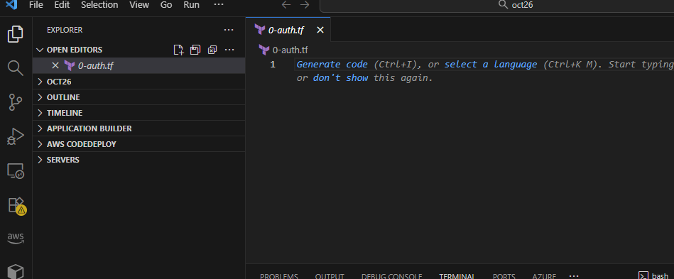

## Prerequisites
### 1. Ensure  the aws cli ,terraform and .ignorefile are present
### 1.1 Open git bash as an admin (Windows users only)
.png)
### 1.2  run this command 
> curl https://raw.githubusercontent.com/aaron-dm-mcdonald/Class7-notes/refs/heads/main/101825/check.sh | bash>

If you run into this error 
run this command instead 
> curl --ssl-no-revoke https://raw.githubusercontent.com/aaron-dm-mcdonald/Class7-notes/refs/heads/main/101825/check.sh | bash >

You should see this message ( except the lack of upgrades if terraform is already up to date)
.png)
### 2. In gitbash or your vscode terminal type in the following path 
.png)

### 3. Verify that you are in the correct folder by looking at the yellow characters 
.png)
### 4. use ls -a command to verify the presence of .gitignore file
.png)
### 5.use mkdir && cd "projectfolder" command to make a sub folder with Terraform & move into it (notice how the path in yellow characters is displaying projectfolder name)
.png)
### 6.type in touch  0-auth.tf &  touch 1-main.tf (creates new files)
.png)
### 7. Type in ls -a +enter to verify 0-auth.tf &  touch 1-main.tf are present 

### 8. go to https://registry.terraform.io/ & click browse providers

### 9. Click on the AWS logo

### 10. Click on the purple documentation button on the right hand side

### 11. Scroll down to example usage & copy the following code block

### 12. If you haven't opened vs yet return to git bash 

### 13 Type in  cd ./oct26 (or your project name after the slash)

### 14. To open vscode type in code .+enter

### 15. Click on left side on 0.auth.tf

### 16. Paste the code we copied in Step 11  (make sure to edit your default region unless it's us-east-1)

### 17. Return to the terraform registry web page & type aws vpc in the left side menu

### 18 Under the resources dropdown left click on aws_vpc

### 19.0 Click copy  on the code block right under Example Usage

### 20.00 Return to vs code & left click on 1-main.tf

### 21.00 Paste  the code you copied in  step 19 in the text field show in image below
!

### 22. type in cd ./.. +enter to return to terraform folder
.png)
### 23. Copy the .gitignore file from terraform to project folder ( cp ./.gitignore "name of project folder") 
.png)
### 24. type in cd ./oct26 or (replace oct26 by project folder name)

### 25. Type in terraform init +enter

### 26.Type in terraform validate + enter (results should look like image below)

### 27.Type in terraform plan+enter

## successful terraform apply

**extra comment do not modify tfstate, .terraform.lock.hcl & .terraform folder. Messing them up with can break your infrastructure & will get you fired.** 
=======

  
